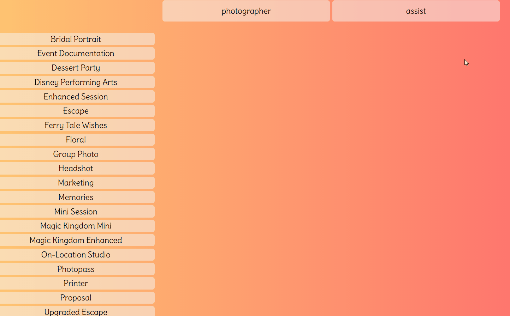
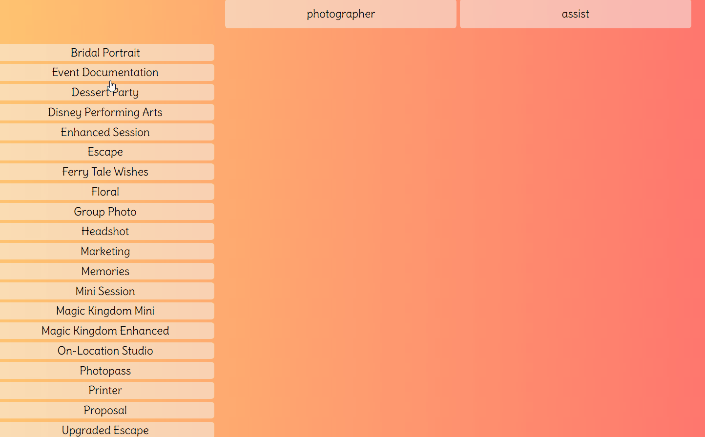

# Scheduling Tools

#### This website was created with Angularjs, Nodejs, and Express. Styled using Sass. An API was created to store each employee and the events each is trained for. This was made for Disney Fine Art Photography as an effiecient way to keep track of what employees are trained for and if they were already asked to work certain events.

#### You can toggle between different states with the navagiation bar directive.

#### From there, you select the kind of event a photographer is needed for. This will grab a list of trained photographers from the API and display a table of results. From there, you  elimiate who has already been asked to work by the "unavailable" button. This will grab the specific name and delete it from the array of results updating the list in real time. The array restores itself when a new event is selected.

